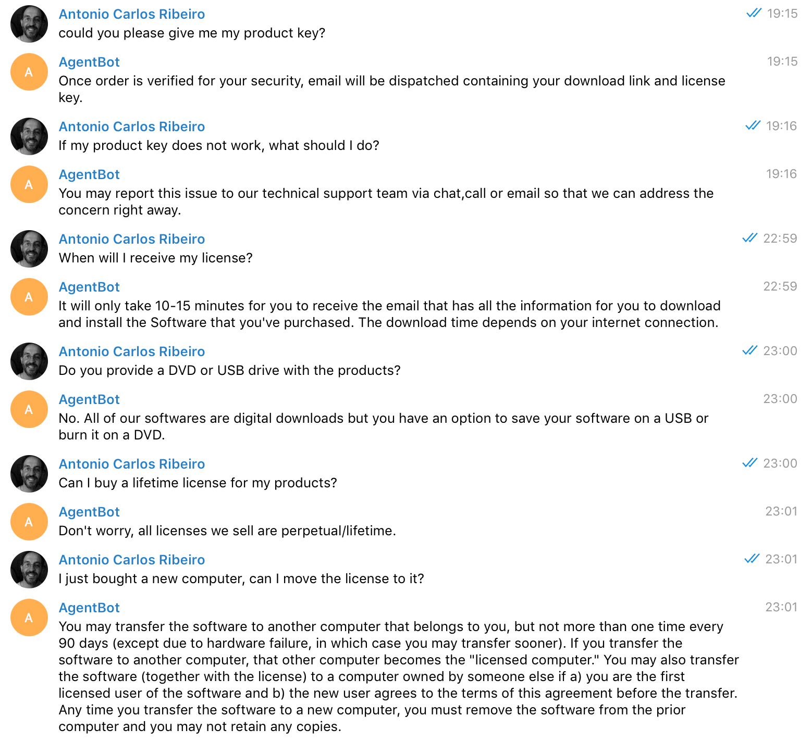

# VanHack AgentBot

It's a bot, it's currently online on Telegram as @VanAgentBot, you can talk to it now!

But it is already compatible with Slack, Facebook Messenger, Microsoft Bot Api, HipChat, WeChat, IRC and more, and it's very easy create bot drivers for anything else, for example: web chat, which was not done yet, because I decided to concentrate my efforts on the conversation. To enable Slack, for example, you just have to create a bot in Slack and set the API Key in the app.

Part of the the bot Natural Language Processing was done using API.AI (https://api.ai/), which is a conversational platform built using Machine Learning, but it is also compatible with other platforms, the other part (user authentication) was done using Laravel. 

Currently the bot does the following:

- Ask for your name (if the chat platform - Telegram - does not provide one),

- Ask for your email address

- Check if the  e-mail address provide is from a customer (it accepts all @gmail.com as customers)

- Send an activation code to the e-mail address and ask the user to give it back

- If the user is able to pass authentication, it stores the chat and start a conversation

- Understand and answers the first 7 questions plus the first question with image are done and trained on API.AI. The service interface is really easy to use, so you can add new questions (intents), adding many variations (which will help machine learning), but also different responses for the same intent, cards, and any kind of answer (text, image, and more).

- Questions: it basically understands questions, even if you don't type them right, even if phrase it differently.

- It stores users, chats, chat messages (questions and answers), chat types (telegram, facebook, slack...)

- You can use MySQL or any other database out of the box, just set the database type and migrate the tables.

- Telegram only works in HTTPS environments, a lot of the time in this project was used configuring the environment (domain, ssl cert, telegram, etc.)

I was not really free to do this, so the whole project was done in around 16 hours.

Here's the project link: https://github.com/antonioribeiro/vanhack-agentbot
